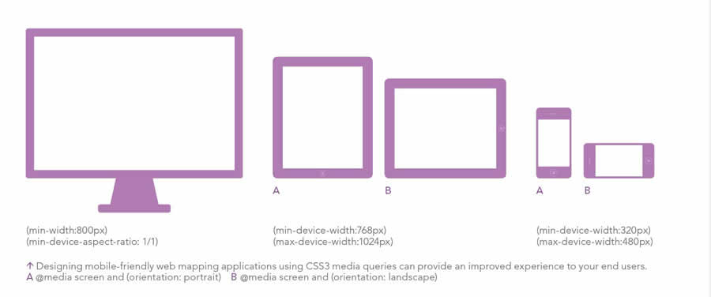

# CSS Media Queries

## Definition

The `@media` rule is used in media queries to apply different styles for different media types/devices.

Media queries can be used to check many things, such as:

- width and height of the viewport
- width and height of the device
- orientation (is the tablet/phone in landscape or portrait mode?)
- resolution

Media queries are used for the following:

- To conditionally apply styles with the [CSS](https://developer.mozilla.org/en-US/docs/Web/CSS) `[@media]`(https://developer.mozilla.org/en-US/docs/Web/CSS/@media) and `[@import]`(https://developer.mozilla.org/en-US/docs/Web/CSS/@import) [at-rules.](https://developer.mozilla.org/en-US/docs/Web/CSS/At-rule)
- To target specific media for the `[<style>]`(https://developer.mozilla.org/en-US/docs/Web/HTML/Element/style), `[<link>]`(https://developer.mozilla.org/en-US/docs/Web/HTML/Element/link), `[<source>]`(https://developer.mozilla.org/en-US/docs/Web/HTML/Element/source), and other [HTML](https://developer.mozilla.org/en-US/docs/Web/HTML) elements with the `media=` attribute.
- To [test and monitor media states](https://developer.mozilla.org/en-US/docs/Web/CSS/Media_Queries/Testing_media_queries) using the `[Window.matchMedia()]`(https://developer.mozilla.org/en-US/docs/Web/API/Window/matchMedia) and `[MediaQueryList.addListener()]`(https://developer.mozilla.org/en-US/docs/Web/API/MediaQueryList/addListener) [JavaScript](https://developer.mozilla.org/en-US/docs/Web/JavaScript) methods.

## Syntax

```css
@media not|only mediatype and|not|only (media feature) {
  .my-code { … }
}
```

### Media Types

*Media types* describe the general category of a device. Except when using the `not` or `only` logical operators, the media type is optional and the `all` type will be implied.

- **`all`**Suitable for all devices.
- **`print`**Intended for paged material and documents viewed on a screen in print preview mode. (Please see [paged media](https://developer.mozilla.org/en-US/docs/Web/CSS/Paged_Media) for information about formatting issues that are specific to these formats.)
- **`screen`**Intended primarily for screens.
- **`speech`**Intended for speech synthesizers.

### Media Features

**Mostly used features**

- `width`
- `min-width` / `max-width`
- `orientation` : portrait, landscape

[Here](https://developer.mozilla.org/en-US/docs/Web/CSS/Media_Queries/Using_media_queries) you have more information about the specifications.

### Example Code

```css
@media screen and (max-width: 400px) { … }
```

## Breakpoints in Media Queries




## Related Links

- [https://developer.mozilla.org/en-US/docs/Web/CSS/Media_Queries/Using_media_queries](https://developer.mozilla.org/en-US/docs/Web/CSS/Media_Queries/Using_media_queries)
- [https://www.seobility.net/en/wiki/Media_Queries](https://www.seobility.net/en/wiki/Media_Queries)