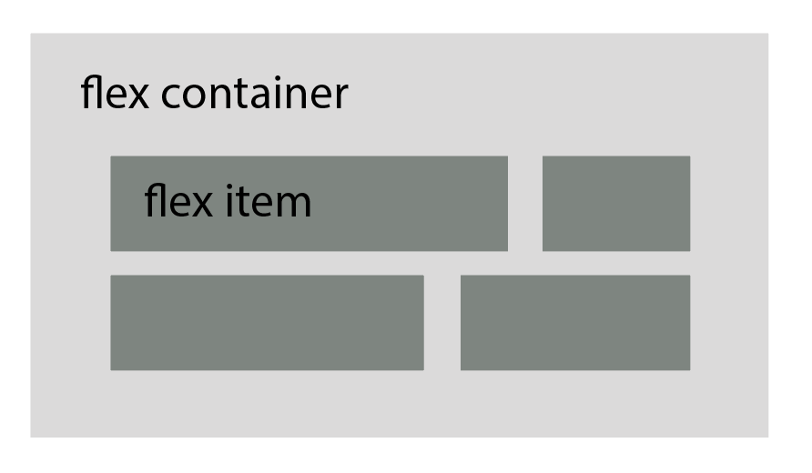
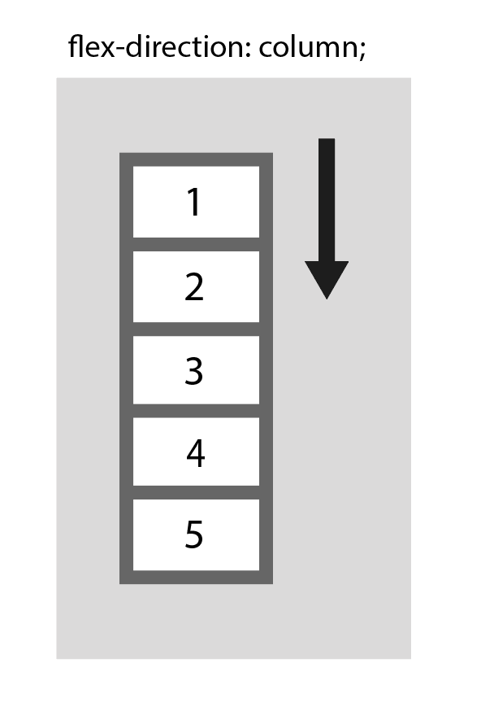
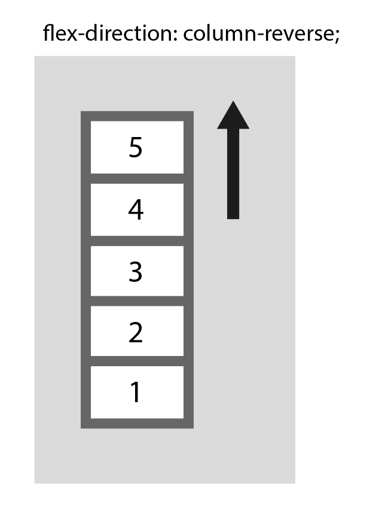
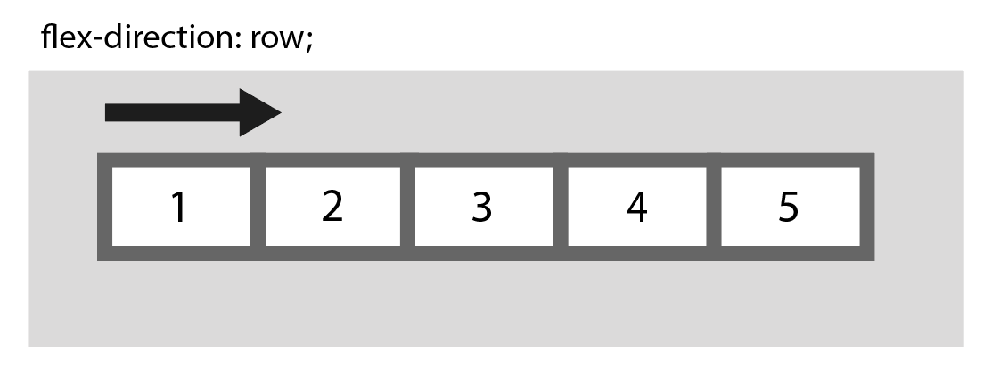
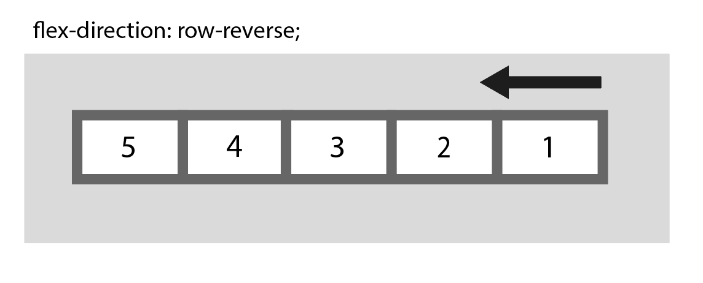
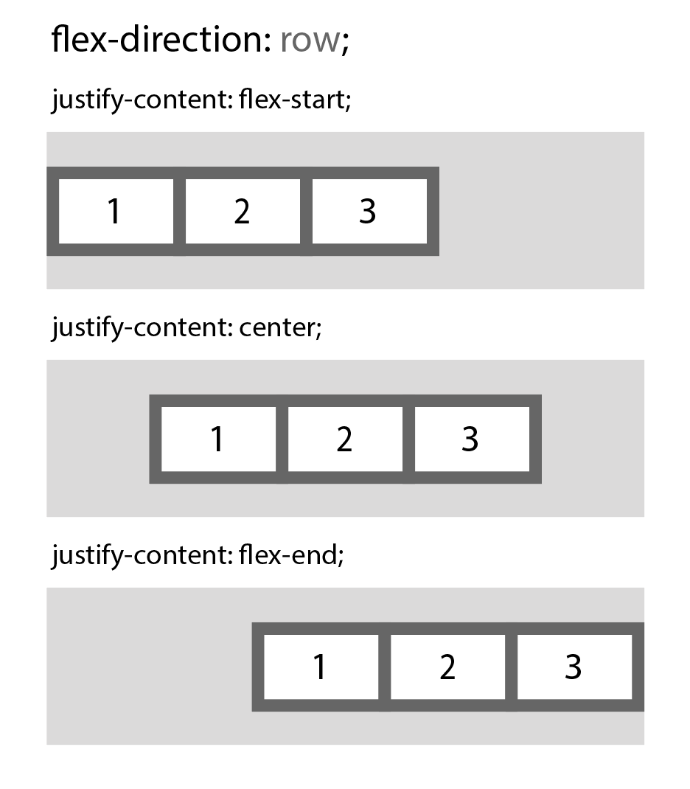
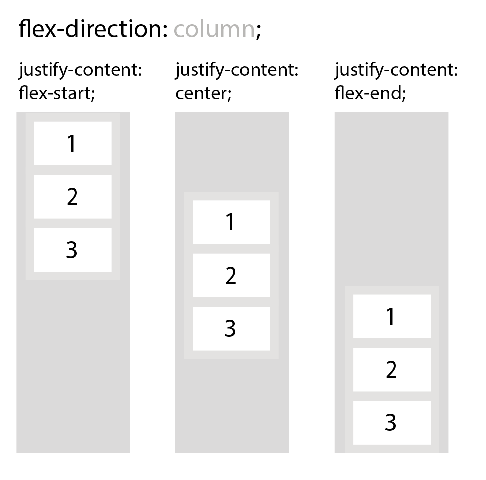
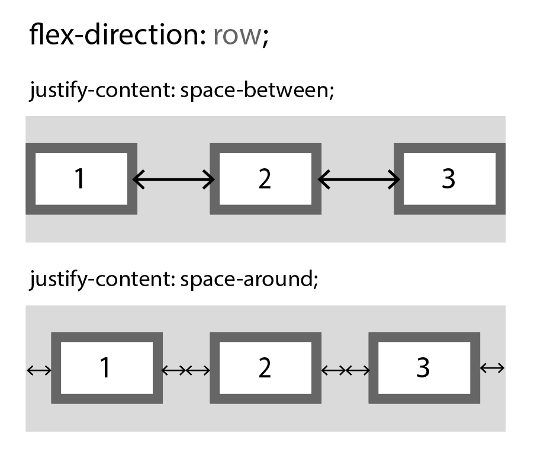
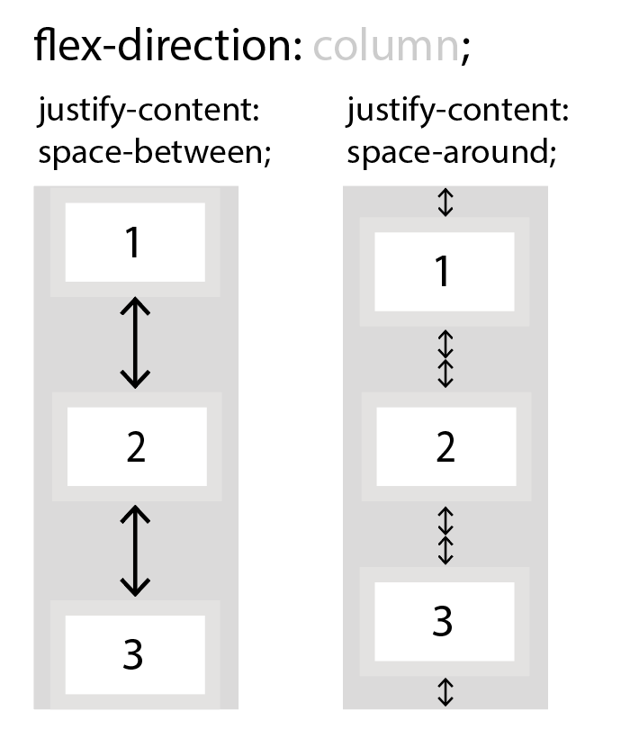

*Basic structure of flexbox*

Parent element(container) must have `display`: flex property.

```css
.flex-container {
  display: flex;
}
```

The flex container properties

- `flex-direction`
- `flex-wrap`
- `flex-flow`
- `justify-content`
- `align-items`
- `align-content`

## All Properties

| Property        | Description                                                  |
| -------------- | ----------------------------------------------------------- |
| **display**         | Specifies the type of box used for an HTML element           |
| **flex-direction**  | Specifies the direction of the flexible items inside a flex container |
| **justify-content** | Horizontally aligns the flex items when the items do not use all available space on the main-axis |
| align-items     | Vertically aligns the flex items when the items do not use all available space on the cross-axis |
| **flex-wrap**       | Specifies whether the flex items should wrap or not, if there is not enough room for them on one flex line |
| align-content   | Modifies the behavior of the flex-wrap property. It is similar to align-items, but instead of aligning flex items, it aligns flex lines |
| **flex-flow**       | A shorthand property for flex-direction and flex-wrap        |
| order           | Specifies the order of a flexible item relative to the rest of the flex items inside the same container |
| align-self      | Used on flex items. Overrides the container's align-items property |
| flex            | A shorthand property for the flex-grow, flex-shrink, and the flex-basis properties |


## flex-direction

defines direction of stack from flex items

- `column`: vertical, from top to bottom



- `column-reverse`: vertical, from bottom to top



- `row`: horizontal, from left to right



- `row-reverse`: horizontal, from right to left



## flex-wrap

specifies wrap of the flex items. Default is `nowrap`.

```css
.flex-container {
  display: flex;
  flex-wrap: wrap;
}
```

- `wrap`: wrap if necessary
- `nowrap`
- `wrap-reverse`: wrap if necessary in reverse order

## flex-flow

shorthand property for setting both the `flex-direction` and `flex-wrap`

```css
.flex-container {
  display: flex;
  flex-flow: row wrap;
}
```

## justify-content

align the flex items

```css
.flex-container {
  display: flex;
  justify-content: center;
}
```

- `center`
- `flex-start`
- `flex-end`
- `space-around`
- `space-between`

### flex-start, center, flex-end





### space-between / space-around





## Related Links

- [https://www.w3schools.com/css/css3_flexbox.asp](https://www.w3schools.com/css/css3_flexbox.asp)
- [https://edu.goorm.io/lecture/16322/한-눈에-끝내는-html5-css3](https://edu.goorm.io/lecture/16322/한-눈에-끝내는-html5-css3)