The flex container properties

- `flex-direction`
- `flex-wrap`
- `flex-flow`
- `justify-content`
- **`align-items`**
- **`align-content`**

## All Properties

| Property        | Description                                                  |
| -------------- | ----------------------------------------------------------- |
| **display**         | Specifies the type of box used for an HTML element           |
| flex-direction  | Specifies the direction of the flexible items inside a flex container |
| justify-content | Horizontally aligns the flex items when the items do not use all available space on the main-axis |
| **align-items** | Vertically aligns the flex items when the items do not use all available space on the cross-axis |
| flex-wrap       | Specifies whether the flex items should wrap or not, if there is not enough room for them on one flex line |
| **align-content** | Modifies the behavior of the flex-wrap property. It is similar to align-items, but instead of aligning flex items, it aligns flex lines |
| flex-flow       | A shorthand property for flex-direction and flex-wrap        |
| order           | Specifies the order of a flexible item relative to the rest of the flex items inside the same container |
| align-self      | Used on flex items. Overrides the container's align-items property |
| flex            | A shorthand property for the flex-grow, flex-shrink, and the flex-basis properties |

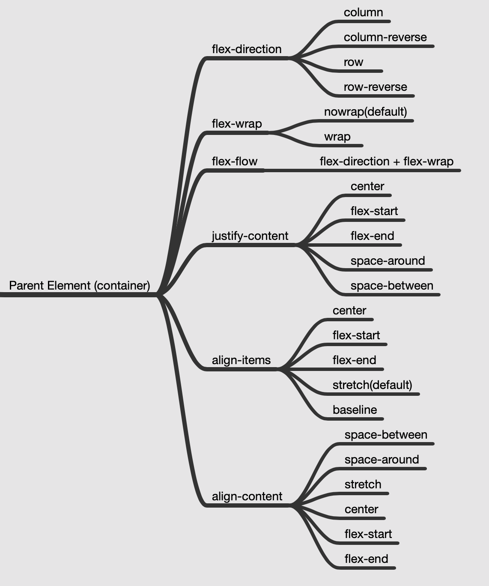

## align-items

The `align-items` property is used to align the flex items vertically.

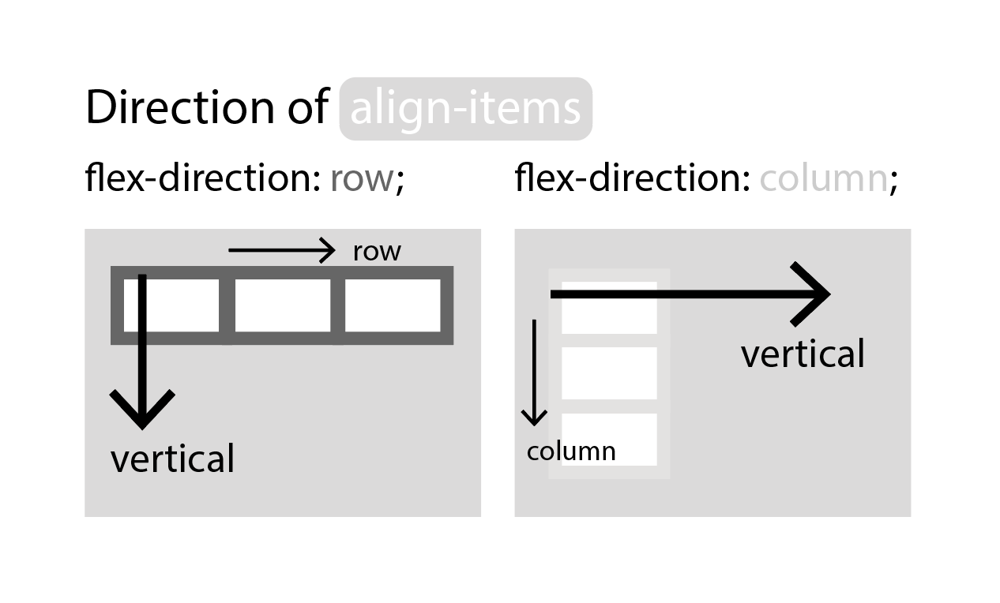

### Properties

- `stretch` : default

- `flex-start`
- `center`
- `flex-end`

### stretch

The *stretch* value stretches the flex items to fill the container.

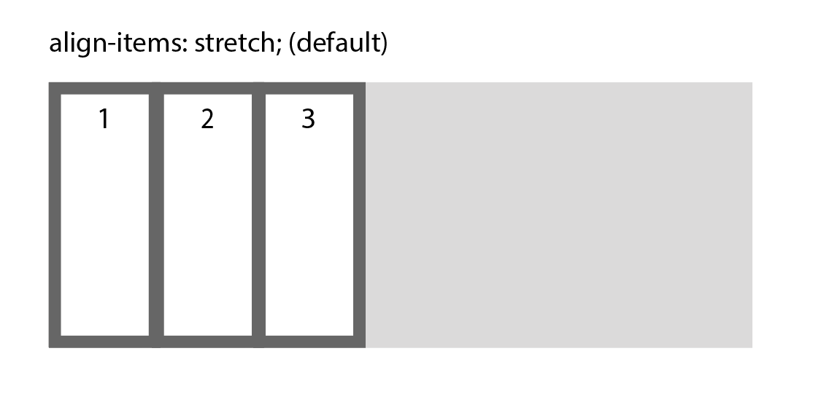

### flex-start, center, flex-end

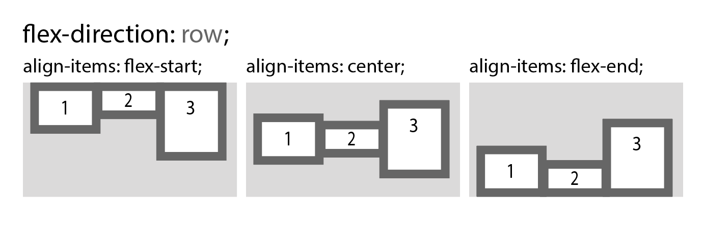

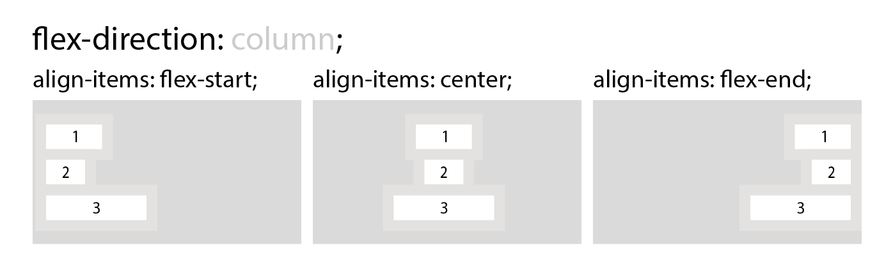

### baseline

The *baseline* value aligns the flex items such as their baselines aligns.

**Note**: *baseline* value can be used also in `justify-content` property. 

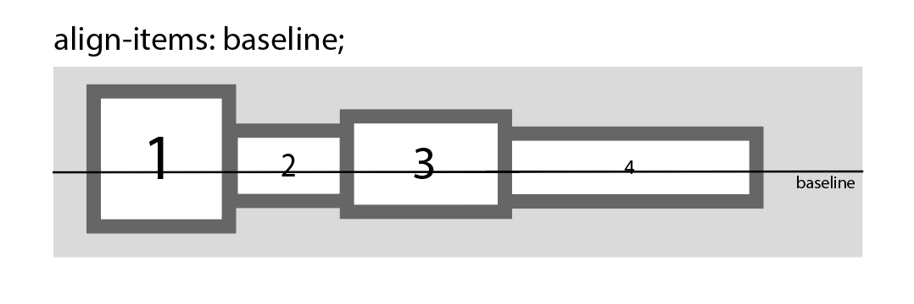

## align-content

The `align-content` property is used to align the flex lines.

- `stretch` : default
- `flex-start`
- `center`
- `flex-end`
- `space-between`
- `space-around`

### flex-start, center, flex-end

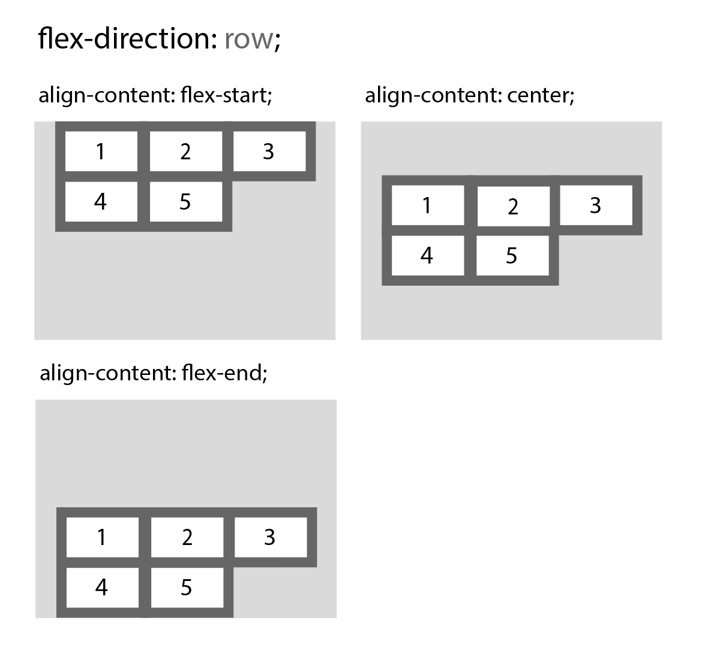

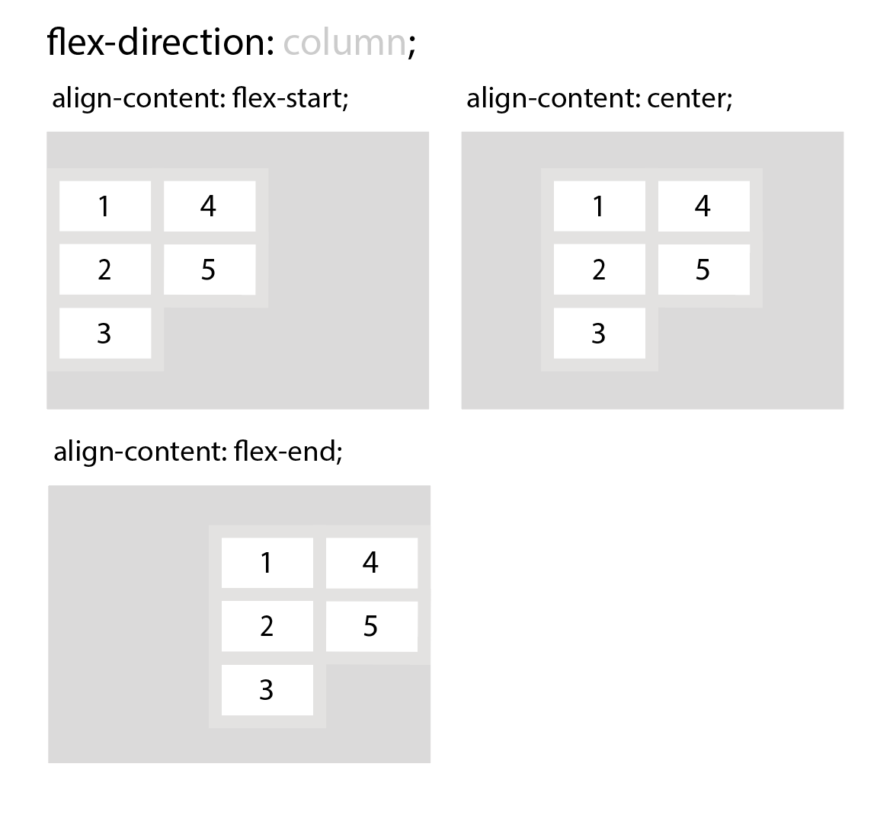

### space-between, space-around

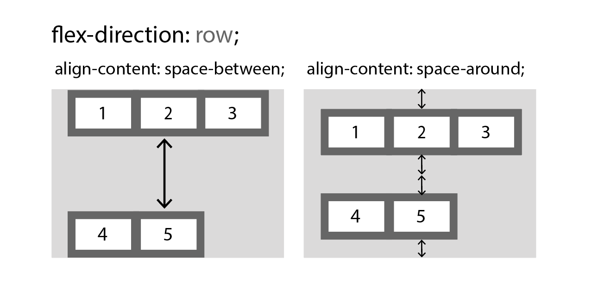

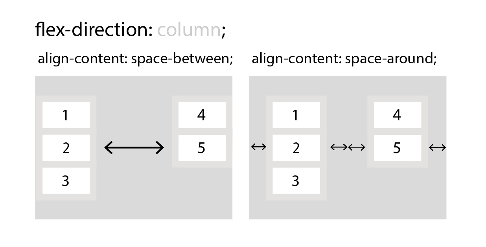

## Difference of align-items from align-content

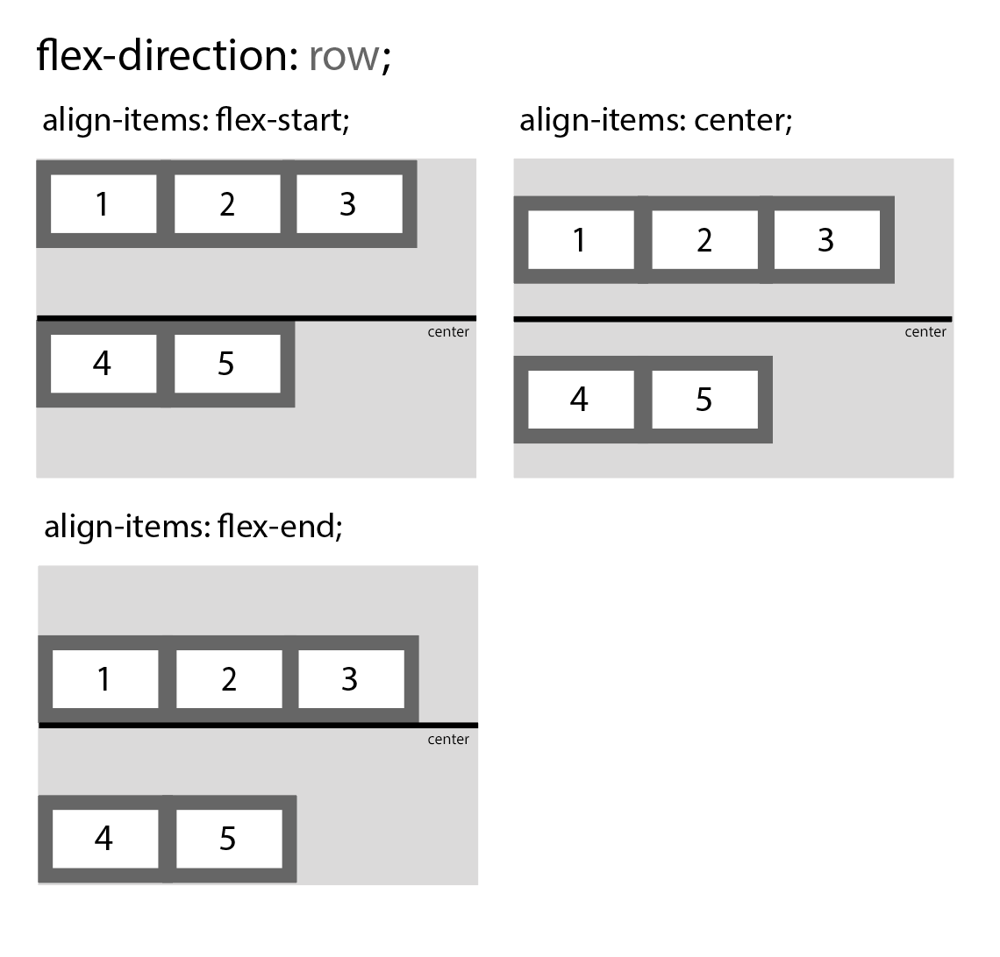

## Related Links

- [https://www.w3schools.com/css/css3_flexbox.asp](https://www.w3schools.com/css/css3_flexbox.asp)
- [https://edu.goorm.io/lecture/16322/한-눈에-끝내는-html5-css3](https://edu.goorm.io/lecture/16322/한-눈에-끝내는-html5-css3)