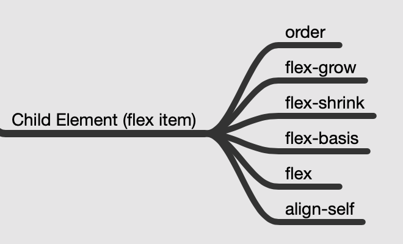

The flex item properties

- **`order`**
- **`flex-grow`**
- **`flex-shrink`**
- **`flex-basis`**
- **`flex`**
- **`align-self`**



## All Properties

| Property        | Description                                                  |
| -------------- | ----------------------------------------------------------- |
| **display**         | Specifies the type of box used for an HTML element           |
| flex-direction  | Specifies the direction of the flexible items inside a flex container |
| justify-content | Horizontally aligns the flex items when the items do not use all available space on the main-axis |
| align-items | Vertically aligns the flex items when the items do not use all available space on the cross-axis |
| flex-wrap       | Specifies whether the flex items should wrap or not, if there is not enough room for them on one flex line |
| align-content | Modifies the behavior of the flex-wrap property. It is similar to align-items, but instead of aligning flex items, it aligns flex lines |
| flex-flow       | A shorthand property for flex-direction and flex-wrap        |
| **order**       | Specifies the order of a flexible item relative to the rest of the flex items inside the same container |
| **align-self**  | Used on flex items. Overrides the container's align-items property |
| **flex**        | A shorthand property for the flex-grow, flex-shrink, and the flex-basis properties |

## Order

The `order` property specifies the order of the flex items.
```html
<div class="flex-container">
  <div style="order: 3">1</div>
  <div style="order: 2">2</div>
  <div style="order: 4">3</div>
  <div style="order: 1">4</div> 
</div>
```


## flex-grow

The `flex-grow` property specifies how much a flex item will grow relative to the rest of the flex items. The value must be a number, default value is 0.


## flex-shrink

The `flex-shrink` property specifies how much a flex item will shrink relative to the rest of the flex items. The value must be a number, default value is 1.


## flex-basis

The `flex-basis` property specifies the initial length of a flex item.

### flex-basis: auto;


### flex-basis: 0;


### flex-basis: 100px;


## align-self

The `align-self` property specifies the alignment for the selected item inside the flexible container. The `align-self `property overrides the default alignment set by the container's `align-items` property.

## flex

The `flex` property is a shorthand property for the `flex-grow`, `flex-shrink`, and `flex-basis` properties.

```html
<div class="flex-container">
  <div>1</div>
  <div>2</div>
  <div style="flex: 0 0 200px">3</div>
  <div>4</div>
</div>
```


## Related Links

- [https://www.w3schools.com/css/css3_flexbox.asp](https://www.w3schools.com/css/css3_flexbox.asp)
- [https://edu.goorm.io/lecture/16322/한-눈에-끝내는-html5-css3](https://edu.goorm.io/lecture/16322/한-눈에-끝내는-html5-css3)